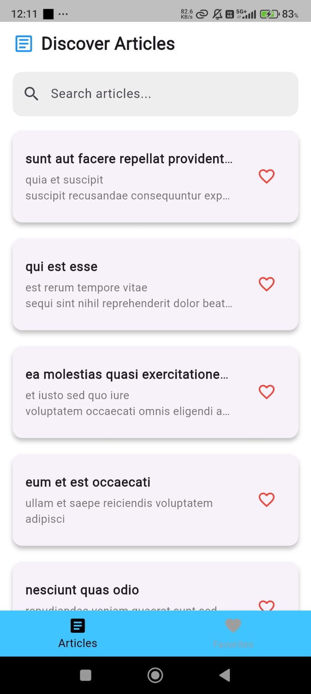
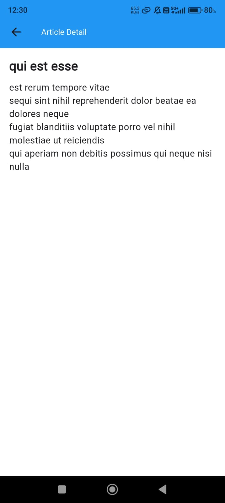
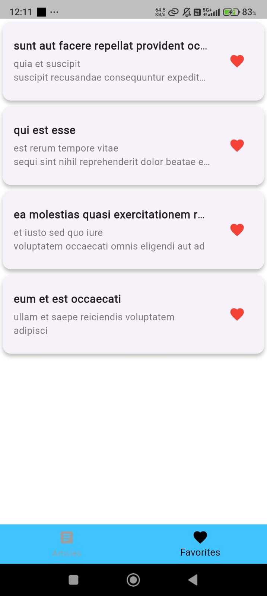

# articles

A new Flutter project.

A simple Flutter app that displays a list of articles fetched from an API.  
Includes search functionality and article detail view.

## Features

- Fetches articles from JSONPlaceholder API
- Displays article list with titles
- Search bar to filter articles
- View full article details on a separate screen
- Clean UI and responsive design

## Setup Instructions

1. Clone the repo:  
   ```bash
   git clone https://github.com/faizan0213/article-app.git  
   cd article-app
   
2. Install dependencies: 
   flutter pub get

3. Run the app: 
   flutter run   

 
## Tech Stack 
- Flutter SDK: [3.6.2]
- State Management: [Provider]
- HTTP Client: [http]
- Persistence: [shared_preferences]

## State Management Explanation 
[I choose Provider for this app because it offers a simple and efficient way to manage app-wide state in a reactive manner. It helps with separating business logic from the UI, making your code more modular and easier to maintain.] 

## Screenshots

### Home Screen


### Detail Screen


### favourite Screen



    
